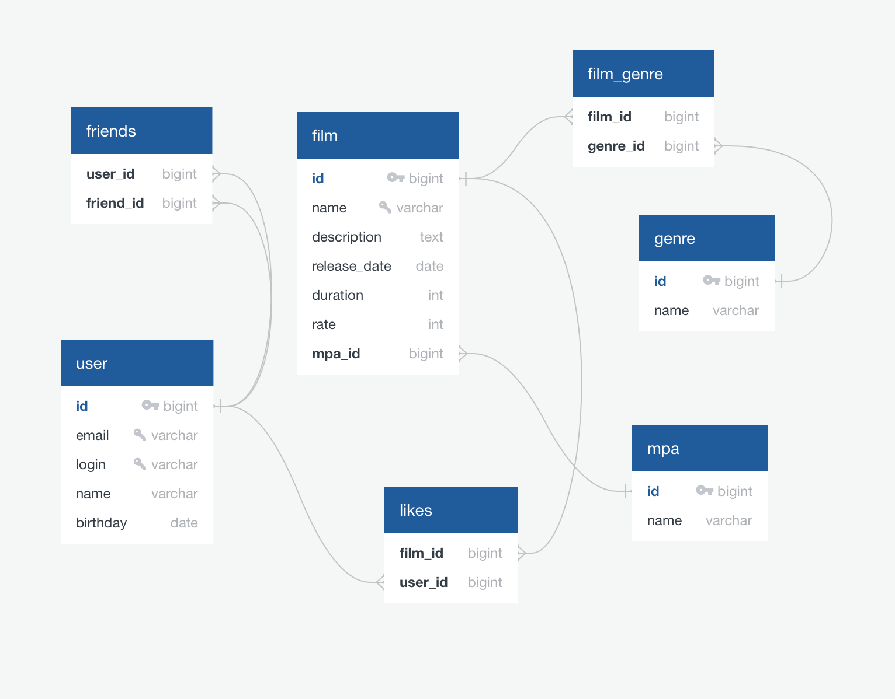

# Filmorate
Backend service that works with movies and user ratings.
### Functional:
You can add, delete, update films and users,
add or delete friends, also you can like films and get most popular films by likes.
## Database schema

### Technology stack:
Java 11, Spring Framework, H2, Maven, JDBC, Mockito

### System requirements:
JDK 11

### Startup instructions:
1. Download zip-file  
2. Unpack zip-file  
3. Open app in IntellijIdea  
4. Start app from main class  
5. Test app with postman tests collection in postman package  
